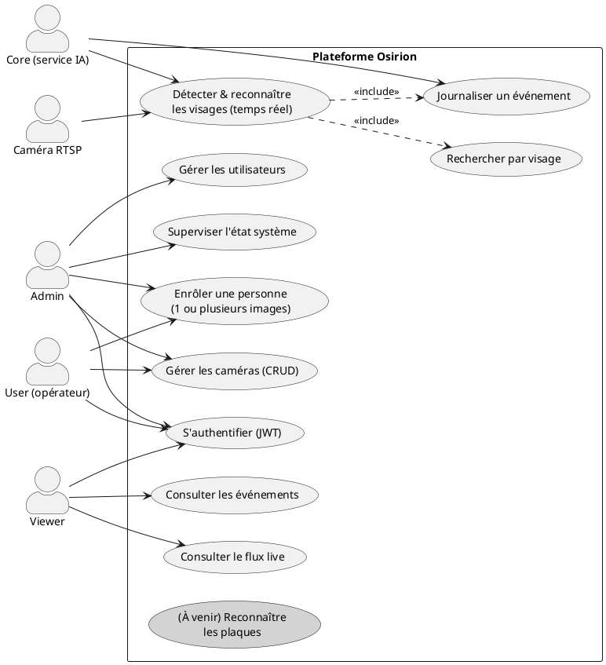
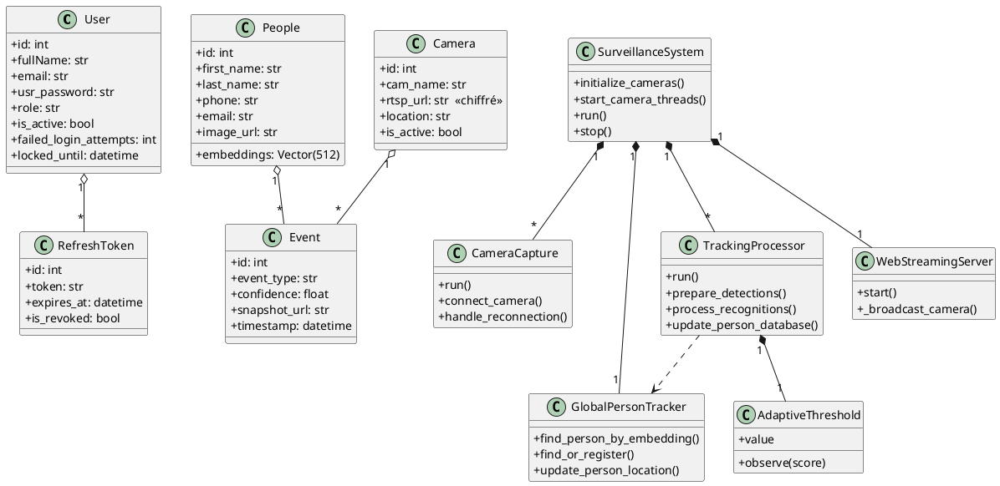
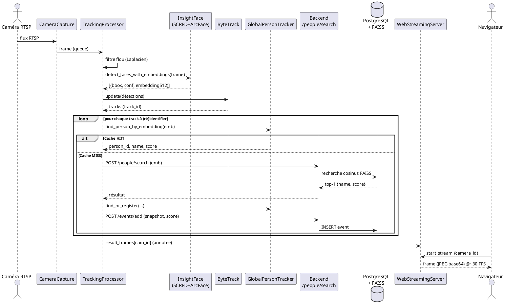
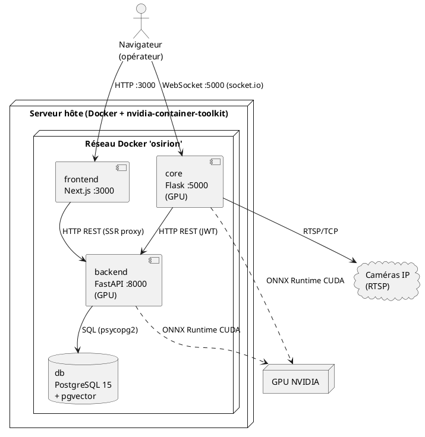
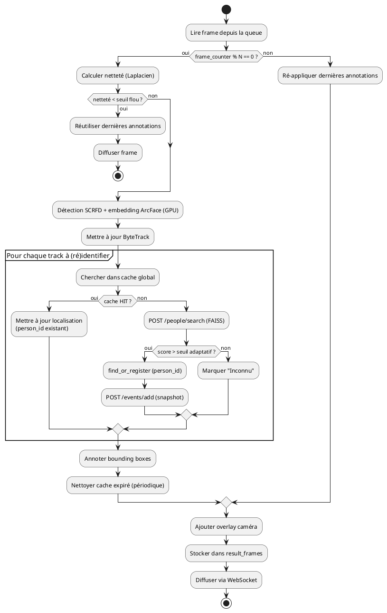

# Analyse technique exhaustive — Projet **Osirion**
### Système intelligent de vidéosurveillance par IA (reconnaissance faciale + [reconnaissance de plaques — à venir])

> Document d'analyse préparatoire au mémoire. Basé **uniquement** sur le code source réellement présent dans le dépôt.
> Chaque affirmation incertaine est accompagnée d'un **niveau de confiance** : 🟢 Élevé (lu directement dans le code) · 🟡 Moyen (déduit) · 🔴 À vérifier par l'étudiant.

---

## Table des matières
1. [Présentation générale](#1-présentation-générale)
2. [Analyse fonctionnelle](#2-analyse-fonctionnelle)
3. [Architecture générale](#3-architecture-générale)
4. [Technologies utilisées](#4-technologies-utilisées)
5. [Module de reconnaissance faciale](#5-module-de-reconnaissance-faciale)
6. [Module de reconnaissance des plaques](#6-module-de-reconnaissance-des-plaques) *(non implémenté — à développer)*
7. [Analyse de la base de données](#7-analyse-de-la-base-de-données)
8. [Diagrammes à produire pour le mémoire](#8-diagrammes-à-produire)
9. [Points faibles et limites](#9-points-faibles-et-limites)
10. [Pistes d'amélioration](#10-pistes-damélioration)

---

## 1. Présentation générale

### 1.1 Objectif principal
Osirion est une **plateforme de vidéosurveillance intelligente** qui exploite des flux vidéo RTSP de caméras IP pour **détecter, suivre et identifier automatiquement des personnes** par reconnaissance faciale, en **temps réel** et sur **plusieurs caméras simultanément**. Le système centralise les identités connues, journalise les événements de reconnaissance (avec capture d'image) et diffuse les flux annotés vers une interface web d'administration. 🟢

### 1.2 Contexte d'utilisation
Surveillance multi-caméras sur réseau local/IP (caméras RTSP). Le README du Core cite explicitement les cas d'usage : surveillance d'entreprise, contrôle d'accès intelligent, analyse de flux en magasin, sécurité événementielle, *smart cities*. 🟢

### 1.3 Problème résolu
- **Identification automatique** : reconnaître une personne enregistrée dès qu'elle apparaît devant n'importe quelle caméra, sans intervention humaine.
- **Suivi inter-caméras** : maintenir une identité unique (`person_id`) lorsqu'une personne se déplace d'une caméra à l'autre, tout en **réduisant massivement les appels au moteur de reconnaissance** (cache global → ~75-80 % d'appels API économisés d'après la documentation interne `MULTI_CAMERA_TRACKING.md`). 🟢 *(le chiffre de 75-80 % est une estimation du projet, non mesurée par un benchmark présent dans le code 🔴)*
- **Centralisation** : une base unique de personnes + un journal d'événements horodatés avec snapshots.

### 1.4 Utilisateurs cibles
Le backend définit **3 rôles** (`app/models/users.py`, `UserRole`) : 🟢
| Rôle | Droits (déduits du `auth_middleware.py`) |
|------|------------------------------------------|
| `admin` | Accès complet : gestion utilisateurs, caméras, personnes, monitoring système |
| `user`  | Gestion des caméras et ajout de personnes (pas la gestion des utilisateurs) |
| `viewer`| Lecture seule (consultation caméras, personnes, événements) |

Utilisateurs métier visés : opérateurs de sécurité / centres de supervision, administrateurs système. 🟡

---

## 2. Analyse fonctionnelle

### 2.1 Vue d'ensemble des fonctionnalités existantes

**Authentification & sécurité (backend)** 🟢
- Inscription, connexion, déconnexion (`/auth/register`, `/login`, `/logout`).
- JWT à deux niveaux : *access token* (30 min) + *refresh token* (7 j) avec **rotation** et stockage en base (`refresh_tokens`).
- Hachage des mots de passe (bcrypt via `auth_utils`), **verrouillage de compte** après échecs répétés (`failed_login_attempts`, `locked_until`).
- **Contrôle d'accès par rôle** (RoleChecker) + **rate limiting** (slowapi).
- Chiffrement des URL RTSP en base via **Fernet** (`security_utils.crypter/decrypter`).

**Gestion des personnes / enrôlement** 🟢
- Enrôlement par **1 image** (`POST /people/upload/`) avec augmentation automatique (flip, rotation ±7°, +15 % luminosité) → centroïde d'embeddings.
- Enrôlement par **2 à 5 images** (`POST /people/upload/multi/`) → centroïde direct.
- **Détection de doublons** au moment de l'enrôlement (refus si similarité cosinus > 0.90).
- Liste des personnes (`GET /people/list/`), recherche par embedding (`POST /people/search/`).

**Gestion des caméras** 🟢
- CRUD complet (`/cameras/add`, `/`, `/{id}`, `/update/{id}`, `/delete/{id}`), URL RTSP chiffrée.

**Journal d'événements** 🟢
- Création d'événement avec snapshot (`POST /events/add`), liste et consultation (`GET /events/`).
- Types d'événements définis : `RECOGNITION`, `ENTRY`, `EXIT`, `DETECTION` (constante `EVENTS` dans le Core). 🟢 *(Seul `RECOGNITION` est réellement émis par le pipeline actuel ; `ENTRY/EXIT/DETECTION` sont déclarés mais non générés 🟡)*

**Surveillance temps réel (core)** 🟢
- Capture RTSP multi-caméras (1 thread capture + 1 thread traitement par caméra) avec **reconnexion automatique** (backoff exponentiel, transport TCP forcé).
- Détection de visages + embeddings (InsightFace `buffalo_l`, GPU CUDA si dispo).
- **Tracking multi-objets** par ByteTrack (un tracker par caméra).
- **Filtre qualité de frame** (variance du Laplacien) pour rejeter les images floues avant l'inférence GPU.
- **Seuil de reconnaissance adaptatif par caméra** (méthode d'Otsu + lissage exponentiel).
- **Cache global inter-caméras** (`GlobalPersonTracker`) pour éviter les reconnaissances répétées.
- **Streaming WebSocket** (Flask-SocketIO) : diffusion des frames annotées (JPEG/base64) par « room » de caméra, avec cache JPEG partagé entre clients.
- API REST de service : `GET /api/cameras`, `GET /api/stats`.

**Interface web (frontend Next.js)** 🟢
- Dashboard admin : visualisation **live** (canvas + socket.io), gestion caméras, gestion utilisateurs, état système, paramètres, pages *blacklist* et *alerts*.
- Proxy d'API côté serveur Next.js vers le backend, `AuthContext`, `RoleGuard`, rafraîchissement de token (`fetchWithRefresh.js`).

**Monitoring système** 🟢
- `GET /sysInfo/` (admin) : CPU, RAM, swap, disques, réseau via `psutil`.
- Endpoints de santé : backend `/health` (DB + état index FAISS), core `/api/stats`.

### 2.2 Fonctionnalités **terminées** (opérationnelles dans le code) 🟢
- Authentification JWT complète + rôles + rate limiting + verrouillage compte.
- Enrôlement facial (mono- et multi-images) avec centroïde et anti-doublon.
- Index vectoriel FAISS (cosinus) + recherche par similarité.
- Pipeline live : capture RTSP → détection/embedding → ByteTrack → reconnaissance → événement → streaming WebSocket.
- Cache global inter-caméras thread-safe.
- Frontend de supervision (live, caméras, utilisateurs, settings, system-status).
- Orchestration Docker Compose des 4 services (db, backend, core, frontend) avec support GPU NVIDIA.

### 2.3 Fonctionnalités **en cours / partielles** 🟡
- **Événements ENTRY/EXIT/DETECTION** : types déclarés mais seul `RECOGNITION` est émis. 🟢
- **Pages frontend `blacklist` et `alerts`** : présentes dans l'arborescence mais leur logique métier n'a pas de table/endpoint backend dédié (pas de modèle « blacklist » ni « alert » en base). 🔴 *(à confirmer en lisant ces pages)*
- **Vérification d'email / `is_verified`** : champ présent, mais l'envoi d'email est marqué `TODO` dans `auth_routes.py`.
- **Réinitialisation de mot de passe** : endpoint présent mais corps `TODO` (pas d'envoi d'email).
- **Authentification du WebSocket du Core** : signalée « TODO » dans le README (le flux vidéo n'est pas protégé par JWT côté Socket.IO). 🟢
- Présence de **deux points d'entrée Core** (`main.py` legacy monolithique et `main_refactored.py` modulaire) et de **deux modules de détection** (`face_detection.py`, `face_detection_new.py`) → dette technique / code en transition. 🟢

### 2.4 Fonctionnalités **prévues mais NON implémentées** 🟢
- **Reconnaissance des plaques d'immatriculation** : **AUCUN code** (ni backend, ni core, ni modèle, ni table). La seule trace est un **interrupteur d'interface** `settings.licencePlateRecognition` dans `app/Osirion/admin/settings/page.js` (libellé « Plaques d'immatriculation — Lire et identifier les plaques »). C'est un **placeholder UI** sans backend. **→ C'est le module que l'étudiant doit développer.** (cf. §6)
- **Détection d'objets** : idem, simple *toggle* UI (`settings.objectDetection`), non implémenté.
- Roadmap README (non implémentée) : architecture distribuée (workers GPU), cache Redis, métriques Prometheus/Grafana, support Kubernetes, API REST enrichie de trajectoires (`/api/persons/{id}/trajectory`, etc.).

---

## 3. Architecture générale

### 3.1 Vue macroscopique : 4 services conteneurisés
Le `docker-compose.yml` racine orchestre **4 services** sur un réseau bridge `osirion` : 🟢

```
┌──────────────┐   HTTP/REST    ┌───────────────────┐   SQL (psycopg2)   ┌──────────────────────┐
│  FRONTEND    │ ─────────────▶ │     BACKEND        │ ─────────────────▶ │   POSTGRESQL 15      │
│  Next.js 15  │  (proxy SSR)   │  FastAPI :8000     │                    │   + pgvector         │
│  :3000       │ ◀───────────── │  (auth, people,    │ ◀───────────────── │  (camera, people,    │
└──────┬───────┘                │   cameras, events) │                    │   user, event,       │
       │                        └─────────▲──────────┘                    │   refresh_tokens)    │
       │ WebSocket (socket.io)            │ REST (JWT)                     └──────────────────────┘
       │ navigateur ──────────┐           │ /people/search, /events/add
       ▼                      ▼           │
┌─────────────────────────────────────────┴─────────┐        RTSP        ┌──────────────────┐
│                   CORE  (Flask :5000)               │ ◀───────────────── │  Caméras IP      │
│  SurveillanceSystem · CameraCapture · ByteTrack     │                    │  (flux RTSP)     │
│  InsightFace(GPU) · GlobalPersonTracker · WebStream │                    └──────────────────┘
└─────────────────────────────────────────────────────┘
```

| Service | Image / techno | Port | Rôle |
|---------|----------------|------|------|
| `db` | `pgvector/pgvector:pg15` | 5432 (interne) | Stockage relationnel + vecteurs 512D |
| `backend` | FastAPI (image `osirion-backend:gpu`) | 8000 | API métier, enrôlement, recherche FAISS, auth |
| `core` | Flask + Flask-SocketIO (`osirion-core:gpu`) | 5000 | Traitement vidéo temps réel + streaming |
| `frontend` | Next.js standalone | 3000 | Interface d'administration |

> Les services `backend` et `core` réservent un **GPU NVIDIA** (`deploy.resources.reservations.devices`). 🟢

### 3.2 Composants principaux

**Backend (FastAPI)** — `Osirion-backend-main/app/`
- `main.py` : montage des routers, CORS, fichiers statiques (`/uploads`, `/cropped`, `/snapshots`), construction de l'index FAISS au démarrage, `/health`.
- `routes/` : `auth_routes`, `people_routes`, `cameras_routes`, `events_routes`, `users_routes`, `monitoring_routes`.
- `services/` : `embeddings_service` (InsightFace + enrôlement/centroïde), `Faiss_search_service` (index + recherche cosinus), `detection_service` (YOLOv11n-face — *legacy*), `saveImage_service`, `bytesToImage_service`, `sys_monitoring_service`, `recognition_service` (**fichier quasi vide** 🟢).
- `models/` : `users`, `people`, `cameras`, `events`.
- `middleware/` : `auth_middleware` (JWT + rôles), `rate_limit` (slowapi).
- `utils/` : `auth_utils` (JWT, bcrypt, lockout), `security_utils` (Fernet), `images_utils`.
- `alembic/` : 2 migrations (création initiale + colonnes user/refresh_tokens).

**Core (surveillance temps réel)** — `Osirion-core-master/`
- `main_refactored.py` : point d'entrée (logging, signaux, lancement `SurveillanceSystem`, activation du streaming).
- `core/surveillance_system.py` : orchestrateur (init caméras, structures, threads, tracker global).
- `core/camera_manager.py` (`CameraCapture`) : capture RTSP + reconnexion backoff.
- `core/tracking_processor.py` (`TrackingProcessor`) : pipeline détection→tracking→reconnaissance→annotation.
- `core/global_person_tracker.py` (`GlobalPersonTracker`) : cache identités inter-caméras (cosinus vectorisé, thread-safe).
- `core/adaptive_threshold.py` (`AdaptiveThreshold`) : seuil par caméra (Otsu + EWM).
- `core/web_streaming.py` (`WebStreamingServer`) : Flask-SocketIO, broadcast frames.
- `face_detection.py` : InsightFace `buffalo_l` (détection SCRFD + embedding ArcFace 512D, GPU).
- `services/` : `embeddings_search_service` (POST /people/search async), `event_services` (POST /events/add async), `camera_fetching_service` (GET /cameras).
- `utils/auth_utils.py` : login machine-to-machine (le Core s'authentifie au backend avec un compte de service).
- `ByteTrack/` (cloné dans l'image) + `patches/` (correctifs NumPy ≥ 1.24).

**Frontend (Next.js 15, App Router)** — `Osirion-front-end-main/app/`
- `Osirion/admin/` : `live/` (+`CameraStream.js` socket.io), `cameras/`, `users/`, `blacklist/`, `alerts/`, `system-status/`, `settings/`, plus `AdminSidebar`, `AdminTopBar`, `AuthContext`, `RoleGuard`.
- `api/` : routes proxy (login, users, events, images, people, cameras, auth/me, auth/refresh, systemHealth).
- `lib/fetchWithRefresh.js` : appels authentifiés avec refresh automatique.

### 3.3 Interactions entre composants & flux de données

**A. Enrôlement d'une personne (frontend → backend → DB/FAISS)** 🟢
1. L'admin envoie une ou plusieurs images via le frontend.
2. `people_routes.upload[/multi]` → `embeddings_service.enroll_from_images` : détection SCRFD + embedding ArcFace → **centroïde 512D** L2-normalisé.
3. Anti-doublon via `search_similar_people` (rejet si cosinus > 0.90).
4. Sauvegarde image originale (`uploads/`) + crop (`cropped/`), insertion `People` (embedding en colonne `pgvector`), ajout au vecteur FAISS (`add_person_to_index`).

**B. Reconnaissance live (caméra → core → backend → DB)** 🟢
1. `CameraCapture` lit le flux RTSP, redimensionne en 640×480, pousse dans une `queue` (maxsize 4).
2. `TrackingProcessor` traite 1 frame sur `PROCESS_EVERY_N_FRAME` (3 en GPU) :
   - **Filtre flou** (Laplacien < seuil → frame réutilise les dernières annotations).
   - `detect_faces_with_embeddings` (un seul passage GPU : détection + alignement + embedding).
   - `ByteTracker.update` → tracks persistants avec `track_id`.
   - Pour chaque track nouveau ou à ré-identifier : recherche dans le **cache global** ; sinon `POST /people/search` (FAISS cosinus) sur le backend.
   - Si score > seuil adaptatif → personne reconnue → `find_or_register` (cache global) + `POST /events/add` (snapshot + `person_id` + score).
   - Annotation des bounding boxes (vert reconnu / rouge inconnu).
3. La frame annotée est stockée (`result_frames[cam_id]`) et diffusée par `WebStreamingServer` aux clients abonnés.

**C. Visualisation (navigateur ↔ core)** 🟢
- Le navigateur ouvre une connexion Socket.IO vers le Core (`:5000`), émet `start_stream {camera_id}`, reçoit l'événement `frame` (JPEG base64) à ~30 FPS, et dessine sur un `<canvas>`.

**D. Authentification machine (core → backend)** 🟢
- `utils/auth_utils.py` du Core se connecte avec un compte de service (`AUTH_EMAIL`/`AUTH_PASSWORD`), conserve l'access/refresh token, et le rafraîchit (re-check `/auth/me` au plus 1×/min).

---

## 4. Technologies utilisées

### 4.1 Langages
- **Python 3.12** (backend + core). 🟢
- **JavaScript / JSX** (frontend, React 19). 🟢
- **SQL** (PostgreSQL). **Dockerfile / YAML** (déploiement).

### 4.2 Frameworks & bibliothèques
| Domaine | Backend | Core | Frontend |
|---------|---------|------|----------|
| Web/API | **FastAPI**, Uvicorn, SQLModel, Pydantic, slowapi | **Flask**, **Flask-SocketIO**, python-socketio, aiohttp, requests | **Next.js 15**, React 19, Tailwind CSS, lucide-react, socket.io-client |
| IA / Vision | **InsightFace** (`buffalo_l`), ONNX Runtime, OpenCV, NumPy, **Ultralytics YOLO** (legacy) | InsightFace (GPU), ONNX Runtime GPU, OpenCV (headless), **ByteTrack**, lapx, scipy, filterpy | — |
| Recherche vectorielle | **FAISS** (`faiss`) | — | — |
| Base de données | **pgvector** (SQLAlchemy), psycopg2, Alembic | — | — |
| Sécurité | PyJWT, **bcrypt** (passlib), **cryptography/Fernet** | PyJWT | JWT côté cookies/headers |
| Système | psutil | psutil, rich, loguru | — |

### 4.3 Bibliothèques IA — détail 🟢
- **InsightFace `buffalo_l`** = détecteur **SCRFD** + extracteur **ArcFace** (embedding **512 dimensions**). Utilisé **à la fois** dans le Core (live, GPU) et le Backend (enrôlement, CPU).
- **ByteTrack** (YOLOX tracker) pour le suivi multi-objets (association IoU + Kalman).
- **YOLOv11n-face** (`yolov11n-face.pt`, Ultralytics) : présent dans `detection_service.py` du backend mais **non utilisé par le pipeline actuel** (l'enrôlement passe par InsightFace). 🟡 Le README du Core mentionne YOLOv11n pour la détection, mais le code effectif (`face_detection.py`) utilise SCRFD d'InsightFace → **incohérence doc/code à signaler**. 🟢
- **FAISS** : `IndexFlatIP` (produit scalaire = cosinus sur vecteurs normalisés) si < 1000 vecteurs ; bascule vers `IndexIVFFlat` (< 1 M) puis `IndexIVFPQ` (≥ 1 M).

### 4.4 Base de données
- **PostgreSQL 15** + extension **pgvector** (colonne `Vector(512)` pour les embeddings). 🟢
- Migrations gérées par **Alembic**.

### 4.5 Outils de déploiement
- **Docker** + **Docker Compose** (4 services), images CPU/GPU séparées (`requirements-cpu.txt` / `requirements-gpu.txt`).
- **nvidia-container-toolkit** requis pour le GPU.
- `build_images.py` (script de build), bind-mounts pour hot-reload du code.
- Healthchecks Docker sur chaque service.

### 4.6 Autres dépendances notables
- **slowapi** (rate limiting), **python-dotenv** (config `.env`), **loguru/rich** (logs Core), **psutil** (monitoring).

---

## 5. Module de reconnaissance faciale

> **Confiance globale : 🟢 Élevée** — lu intégralement dans `face_detection.py`, `tracking_processor.py`, `embeddings_service.py`, `Faiss_search_service.py`, `global_person_tracker.py`, `adaptive_threshold.py`.

### 5.1 Modèles & algorithmes
| Étape | Algorithme / modèle | Détail |
|-------|---------------------|--------|
| Détection de visage | **SCRFD** (InsightFace `buffalo_l`) | `det_size=(640,640)`, seuil de confiance 0.7 (live) / 0.85 (enrôlement) |
| Alignement | 5 points (interne InsightFace) | aligne avant l'extraction ArcFace |
| Embedding | **ArcFace** | vecteur **512D**, **L2-normalisé** (norme=1.0) |
| Suivi | **ByteTrack** | `track_thresh=0.5`, `match_thresh=0.8`, `track_buffer≈10` frames |
| Comparaison | **Similarité cosinus** | via FAISS `IndexFlatIP` (back) et numpy vectorisé (cache global) |
| Seuil | **Adaptatif (Otsu + EWM)** | initial 0.45, plancher 0.35, plafond 0.80 |
| Qualité image | **Variance du Laplacien** | seuil 80 (640×480 RTSP) ; rejette les frames floues |

### 5.2 Pipeline complet — Enrôlement (offline)
```
Image(s) ──▶ [Filtre flou (Laplacien ≥ 60)] ──▶ [SCRFD détection (det_score ≥ 0.85)]
        │                                              │
        │ (si 1 seule image)                           ▼
        └─▶ 4 augmentations (flip, ±7°, +15% lum.)   [ArcFace embedding 512D + L2-norm]
                                                       │
                                          [Centroïde = moyenne des embeddings → re-L2-norm]
                                                       │
                              [Anti-doublon : cosinus > 0.90 ? → refus]
                                                       │
        [Insertion People (pgvector) + image uploads/ + crop cropped/ + FAISS add_person_to_index]
```

### 5.3 Pipeline complet — Reconnaissance (temps réel)
```
RTSP ─▶ CameraCapture ─(queue)─▶ TrackingProcessor (1 frame / N)
                                    │
                          [Quality gate : Laplacien < 80 ? → skip GPU, réutilise annotations]
                                    │ sinon
                          [SCRFD + ArcFace (1 passe GPU) → faces (bbox, conf, embedding 512D)]
                                    │
                          [ByteTrack.update → tracks (track_id persistants)]
                                    │
                  pour chaque track nouveau / à ré-identifier (intervalle 200 frames) :
                                    │
                    ┌───────────────┴────────────────┐
                    ▼                                 ▼
        [Cache global ? cosinus ≥ 0.50]      sinon  [POST /people/search (FAISS cosinus)]
            │ HIT (≈5 ms)                              │
            ▼                                          ▼
   update_person_location                  [score > seuil adaptatif ?]
                                                       │ oui
                                          [find_or_register (person_id unique)]
                                                       │
                                          [POST /events/add (snapshot + score)]
                                    │
                          [Annotation bbox + label (vert/rouge) → result_frames]
                                    │
                          [WebStreamingServer → Socket.IO 'frame' → navigateur]
```

### 5.4 Points d'ingénierie remarquables (à valoriser dans le mémoire) 🟢
- **Cohérence d'échelle cosinus** entre FAISS et cache global (les deux sur `[0,1]`, plus de scaling `(cos+1)/2`).
- **Seuil adaptatif par caméra** : Otsu sépare la distribution bimodale (matches vs non-matches), avec lissage exponentiel et garde-fous plancher/plafond.
- **Cache global thread-safe** avec opération `find_or_register` **atomique** (évite les doublons quand 2 caméras reconnaissent simultanément).
- **Optimisation réseau** : session aiohttp persistante, recherches en parallèle (`asyncio.gather`), retry + backoff, cache JPEG partagé entre clients du streaming.
- **Filtre de netteté** avant inférence GPU (≈0,3 ms vs 15-30 ms d'inférence économisée sur frame floue).

---

## 6. Module de reconnaissance des plaques
### ⚠️ Statut : **NON IMPLÉMENTÉ — c'est le module à développer par l'étudiant**

**Constat factuel (🟢 vérifié par recherche exhaustive dans tout le dépôt) :**
- **Aucun fichier** Python/JS n'implémente la détection ou la lecture de plaques.
- **Aucune table** de base de données (pas de modèle `plate`, `vehicle`, etc.).
- **Aucun endpoint** backend ni service core.
- **Aucune dépendance OCR** dans les `requirements*.txt` (pas d'EasyOCR, PaddleOCR, Tesseract, etc.).
- **Seule trace** : un interrupteur d'interface dans `app/Osirion/admin/settings/page.js` :
  ```
  Plaques d'immatriculation — « Lire et identifier les plaques »
  (state: settings.licencePlateRecognition)  ← simple toggle UI, aucun effet backend
  ```

**Recommandation d'architecture pour le futur module (à concevoir — 🟡 piste) :**
Le module plaques pourra **réutiliser le pipeline existant** par analogie avec le module facial :
1. **Détection de plaque** : modèle type YOLO (`yolov*-license-plate`) sur les frames du Core, en parallèle de la détection de visages.
2. **OCR** : EasyOCR / PaddleOCR / un modèle CRNN pour lire les caractères de la plaque détectée.
3. **Modèles de données** : nouvelles tables `vehicle` (plaque, marque, propriétaire…) et extension de `event` (`event_type = "PLATE"`, champ `plate_text`).
4. **Recherche** : table de plaques « surveillées » (équivalent du `People` facial), correspondance texte (avec tolérance OCR / distance d'édition).
5. **Intégration** : nouvel endpoint backend `/plates/search`, réutilisation de `send_event_async`, affichage frontend (toggle déjà présent).

> *(Cette section sera complétée par l'étudiant lors du développement du module. Aucune affirmation ci-dessus ne décrit du code existant.)*

---

## 7. Analyse de la base de données

> Source : `app/models/*.py` + migrations Alembic. 🟢

### 7.1 Tables et entités

**`camera`** — caméras de surveillance
| Colonne | Type | Rôle |
|---------|------|------|
| `id` | int (PK) | identifiant |
| `cam_name` | varchar(50) | nom |
| `rtsp_url` | text | **URL RTSP chiffrée (Fernet)** |
| `location` | varchar(100) | emplacement |
| `is_active` | bool | caméra active ou non (filtrée par le Core) |
| `created_at` | datetime | date de création |

**`people`** — personnes connues / enrôlées
| Colonne | Type | Rôle |
|---------|------|------|
| `id` | int (PK) | identifiant |
| `first_name`, `last_name` | varchar(50) | identité |
| `phone` | varchar(20) **unique** | téléphone |
| `email` | varchar(100) **unique** | email |
| `addresse` | varchar(100) | adresse |
| `image_url` | text | chemin image originale |
| `embeddings` | **`Vector(512)`** (pgvector) | empreinte faciale (centroïde ArcFace) |
| `created_at` | datetime | date d'enrôlement |

**`user`** — comptes d'accès à la plateforme
| Colonne | Type | Rôle |
|---------|------|------|
| `id` | int (PK) | identifiant |
| `fullName` | varchar(80) | nom complet |
| `email` | varchar(100) **unique, indexé** | login |
| `usr_password` | text | **mot de passe haché (bcrypt)** |
| `role` | varchar(20) | `admin` / `user` / `viewer` |
| `is_active`, `is_verified` | bool | statut du compte |
| `created_at`, `updated_at`, `last_login` | datetime | horodatages |
| `failed_login_attempts` | int | anti-bruteforce |
| `locked_until` | datetime | verrouillage temporaire |

**`refresh_tokens`** — jetons de rafraîchissement JWT
| Colonne | Type | Rôle |
|---------|------|------|
| `id` | int (PK) | identifiant |
| `user_id` | int (FK → user.id, indexé) | propriétaire |
| `token` | text **unique, indexé** | valeur du refresh token |
| `expires_at` | datetime | expiration |
| `created_at` | datetime | création |
| `is_revoked` | bool | révocation (rotation/logout) |
| `device_info` | varchar(255) | User-Agent |
| `ip_address` | varchar(45) | IP du client |

**`event`** — journal des événements détectés
| Colonne | Type | Rôle |
|---------|------|------|
| `id` | int (PK) | identifiant |
| `camera_id` | int (FK → camera.id) | caméra source |
| `person_id` | int (FK → people.id, nullable) | personne reconnue (ou null) |
| `event_type` | varchar(30) | `RECOGNITION` (et prévus ENTRY/EXIT/DETECTION) |
| `confidence` | float (nullable) | score de reconnaissance |
| `snapshot_url` | text (nullable) | image capturée (`snapshots/`) |
| `timestamp` | datetime | horodatage |

### 7.2 Relations
- `event.camera_id` → **`camera.id`** (N:1) — chaque événement provient d'une caméra. 🟢
- `event.person_id` → **`people.id`** (N:1, optionnel) — un événement peut concerner une personne connue ou non (null). 🟢
- `refresh_tokens.user_id` → **`user.id`** (N:1) — un utilisateur possède plusieurs jetons (multi-appareils). 🟢
- **Pas de relation directe** `people` ↔ `user` (les personnes surveillées ≠ utilisateurs de la plateforme). 🟢

### 7.3 Remarques
- Les embeddings sont stockés **en base** (`pgvector`) **et** chargés en mémoire dans **FAISS** au démarrage du backend — FAISS sert de moteur de recherche rapide ; pgvector est la source de vérité persistante. 🟢
- ⚠️ Le `phone` et l'`email` de `people` sont `unique` et **non nullables** → contrainte forte à signaler (peut bloquer l'enrôlement de personnes inconnues). 🟢

---

## 8. Diagrammes à produire

> Pour chaque diagramme : (a) pourquoi il est nécessaire, (b) une version PlantUML prête à compiler, (c) ce que l'étudiant doit vérifier/adapter.
> **PlantUML** se compile sur https://www.plantuml.com/plantuml ou via l'extension VS Code « PlantUML ».

### 8.1 Diagramme de cas d'utilisation
**Pourquoi** : montre les acteurs (rôles) et les fonctionnalités offertes — pose le périmètre fonctionnel du système, indispensable au chapitre « analyse des besoins » du mémoire.


**À vérifier / adapter** 🔴 : confirmer les droits exacts de `viewer` (peut-il voir le live ? — oui via `require_viewer` sur `/cameras`) ; retirer le cas « plaques » si le mémoire ne couvre que l'existant, ou le garder en grisé comme évolution.

### 8.2 Diagramme de classes
**Pourquoi** : représente le modèle de données et les principales classes du Core — montre la conception orientée objet et le schéma relationnel.


**À vérifier / adapter** 🔴 : ajouter les méthodes que tu juges importantes ; si tu veux un diagramme purement « base de données », garder seulement les 5 entités du haut. Vérifier la cardinalité `People–Event` (un événement peut avoir `person_id` null → relation 0..1 côté People).

### 8.3 Diagramme de séquence (reconnaissance temps réel)
**Pourquoi** : c'est **le cœur du système** — il illustre la collaboration caméra → core → backend → DB lors d'une reconnaissance, et la place du cache global.


**À vérifier / adapter** 🔴 : le `POST /events/add` n'est émis **que** lors d'une reconnaissance via API (pas sur cache hit) → adapte si tu changes ce comportement. Tu peux ajouter un fragment montrant la ré-authentification JWT du Core (HTTP 401 → refresh).

### 8.4 Diagramme de déploiement
**Pourquoi** : montre la répartition physique/conteneurs, les ports, le GPU et les protocoles réseau — essentiel pour le chapitre « architecture technique / déploiement ».


**À vérifier / adapter** 🔴 : préciser si backend et core partagent **le même GPU** (le compose réserve 1 GPU à chacun ; sur une seule carte ils la partagent) ; indiquer l'OS/host réel et si un reverse proxy (Nginx) est utilisé en production (recommandé dans le README mais non fourni).

### 8.5 Diagramme d'activité (traitement d'une frame)
**Pourquoi** : décrit la logique algorithmique de décision (flou, détection, cache, seuil) — utile pour expliquer le « comportement » du système au jury.


**À vérifier / adapter** 🔴 : `N = PROCESS_EVERY_N_FRAME` (3 en GPU, 10 dans le `main.py` legacy) ; ajuste la valeur citée dans ton mémoire selon la config réellement déployée.

---

## 9. Points faibles et limites

> Observations factuelles tirées du code. 🟢 sauf mention contraire.

**Architecture & cohérence**
1. **Module plaques inexistant** alors qu'il est un objectif central du mémoire (à développer entièrement).
2. **Double code Core** : `main.py` (monolithe legacy) vs `main_refactored.py` (modulaire) + `face_detection.py` vs `face_detection_new.py` → confusion, dette technique. Il faut documenter lequel fait foi (`main_refactored.py`).
3. **Incohérence documentation/code** : le README annonce « détection YOLOv11n » mais le pipeline réel utilise SCRFD (InsightFace). `detection_service.py` (YOLO) du backend semble inutilisé. 🟡

**Robustesse & passage à l'échelle**
4. **Cache global purement en mémoire** (perdu au redémarrage, non partagé entre plusieurs instances Core). Pas de Redis.
5. **FAISS reconstruit en RAM au démarrage** : pas de persistance de l'index ; sur grand volume, la reconstruction peut être coûteuse.
6. **Threading Python (GIL)** : 2 threads/caméra ; la scalabilité au-delà de quelques caméras dépend fortement du GPU (cf. tableaux de perf du README, non benchmarkés ici 🔴).
7. **Pas de file de messages** entre Core et Backend (appels HTTP synchrones/asynchrones directs) → couplage et sensibilité à la latence réseau.

**Sécurité**
8. **WebSocket du Core non authentifié** (TODO README) : n'importe quel client autorisé par CORS peut s'abonner aux flux vidéo → fuite vidéo potentielle.
9. **CORS par défaut permissif** : `BACKEND_CORS_ORIGINS = ["*"]` côté backend par défaut ; côté Core, fallback `'*'` si non configuré (avec avertissement).
10. **Compte de service Core** : identifiants `AUTH_EMAIL`/`AUTH_PASSWORD` en `.env`, droits élevés ; à cloisonner.
11. **Secrets dans `.env`** committé ? (présence d'un `.env` à la racine — 🔴 vérifier qu'il n'est pas versionné avec de vraies clés).

**Fonctionnel**
12. **Événements ENTRY/EXIT/DETECTION** déclarés mais non générés.
13. **`people.phone`/`email` uniques et obligatoires** : modèle inadapté pour surveiller des personnes dont on n'a pas ces données.
14. **Pages `blacklist`/`alerts`** sans backend dédié (à confirmer 🔴).
15. **Vérification email & reset password** non finalisés (TODO).
16. **Pas de tests** côté Core (quelques tests backend `tests/` existent : faiss, enrollment, embedding). 🟢
17. **Risque de faux positifs** inhérent à la reconnaissance faciale (jumeaux, mauvais éclairage) — le seuil adaptatif atténue mais ne supprime pas.

**Données & vie privée**
18. **Aspect RGPD/éthique** : stockage de données biométriques (embeddings) — un mémoire doit traiter le cadre légal (consentement, durée de conservation, base légale). 🟡

---

## 10. Pistes d'amélioration

**Court terme (consolidation de l'existant)**
- Supprimer le code legacy (`main.py`, `face_detection_new.py` si inutilisé) et aligner README ↔ code.
- Authentifier le WebSocket du Core par JWT (déjà prévu).
- Restreindre les CORS en production ; externaliser/roter les secrets (Vault, secrets Docker).
- Générer réellement les événements `ENTRY`/`EXIT` (logique d'apparition/disparition de track) et `DETECTION`.
- Ajouter des tests automatisés sur le Core (pipeline, tracker global, seuil adaptatif).

**Module plaques (objectif du mémoire)**
- Détection de plaques (YOLO dédié) + OCR (EasyOCR/PaddleOCR/CRNN), nouvelle table `vehicle`, endpoint `/plates/search`, intégration dans `TrackingProcessor` et le journal d'événements (`event_type="PLATE"`, `plate_text`). (cf. §6)

**Performance & scalabilité**
- Persister le cache global et l'index FAISS (Redis / disque) ; index FAISS GPU (`faiss-gpu`).
- Architecture distribuée : workers GPU + file de messages (Kafka/RabbitMQ) entre capture et inférence.
- Batching d'inférence multi-caméras pour saturer le GPU.

**Observabilité**
- Métriques Prometheus + dashboards Grafana (le code émet déjà des logs JSON structurés `osirion.monitoring` exploitables).
- Traçabilité des trajectoires (`/api/persons/{id}/trajectory`) déjà esquissée dans la doc.

**Fonctionnel & UX**
- Module d'alertes temps réel (push WebSocket vers le frontend lors d'une reconnaissance « blacklist »).
- Recherche/filtre avancé d'événements (par personne, caméra, période).
- Gestion fine du consentement et de la conservation des données biométriques (RGPD).

---

### Annexe — Inventaire des fichiers clés analysés
- **Core** : `main_refactored.py`, `main.py`, `config/settings.py`, `core/{surveillance_system,camera_manager,tracking_processor,global_person_tracker,adaptive_threshold,web_streaming}.py`, `face_detection.py`, `services/{embeddings_search_service,event_services,camera_fetching_service}.py`, `utils/auth_utils.py`.
- **Backend** : `app/main.py`, `app/config.py`, `app/models/{users,people,cameras,events}.py`, `app/services/{embeddings_service,Faiss_search_service,detection_service,recognition_service}.py`, `app/routes/{auth,people,cameras,events,monitoring}_routes.py`, `app/middleware/auth_middleware.py`, `app/utils/security_utils.py`, `alembic/versions/*`.
- **Frontend** : `package.json`, `app/Osirion/admin/live/CameraStream.js`, `app/Osirion/admin/settings/page.js`, arborescence `app/api/*` et `app/Osirion/admin/*`.
- **Déploiement** : `docker-compose.yml` (racine), `requirements*.txt`.

> ⚠️ **Fichiers non encore lus en détail** (à parcourir si besoin de plus de précision) : `face_detection_new.py`, pages frontend `blacklist/`, `alerts/`, `cameras/`, `users/`, `system-status/`, `users_routes.py`, `sys_monitoring_service.py`, schémas Pydantic (`app/schemas/*`). Niveau de confiance sur ces zones : 🟡/🔴.
